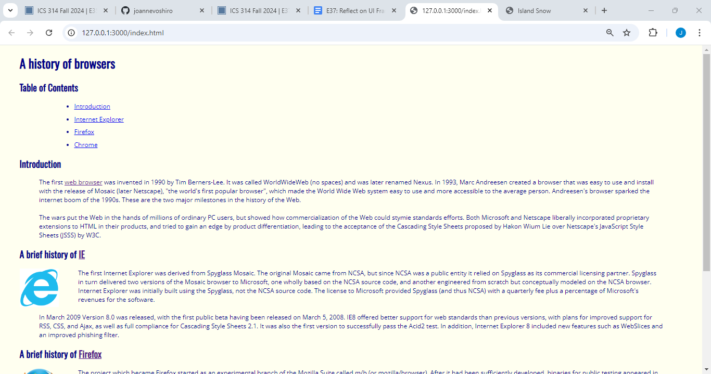

## Why must UI Frameworks be so difficult?
The learning curve to anything completely new to you is a hard thing to deal with and get used to. The comparison made between learning UI Frameworks and a new programming language, in difficulty, truly shows how we need to reflect on the progress being made when learning and also how much knowledge is being retained as well. Something like Bootstrap 5 provides users with various tools that help make components for web design so much more accessible. I guarantee that learning HTML at first may seem very self-explanatory but once I looked into the complexities that even the most simple-looking websites have in their codes, it started to get more complicated and confusing. 

## First experience with HTML (without Bootstrap 5):

During the “E30: BrowserHistory1” exercise, we were instructed to create an index.html file that contained different components that would structure the document into four subsections. We were also given instructions to prove that we’d be able to do things such as link external web pages within the text, create an itemized list for the table of contents, the internal links that led to each section, and insert photos within each subsection. All of which was made using raw HTML rather than relying on Bootstrap 5.

## Recent experience with HTML (with Bootstrap 5):

During the “E35: Island Snow with Bootstrap 5” exercise, we were given a final reference image to base on if our webpage was properly structured. We were informed that this exercise wasn’t aimed to make us able to perfectly recreate the website but rather to get to know the different functions and components that come with Bootstrap 5. Quite a lot of the elements from the “real” Island Snow website seemed to have been dumbed down to help us have an easier time to recreate the site. We were also introduced to the navigation bar and the things that could be implemented regarding that, such as the dropdown menu for the “My Cart” menu item element. Another notable point of what Bootstrap can do is the icons that are easily accessible and easily implemented within the navigation bar.

## Conclusion
In conclusion, I agree that HTML and UI Frameworks have a very big learning curve and will take some getting used to. As seen in the photos above, there is an immediate difference between a website that was constructed with and without a UI Framework such as Bootstrap 5. One final thing that I would like to point out is that the use of AI is much harder to navigate now that we are in the HTML portion of the course. With the way the flow of HTML works, one wrong format or line that an AI like ChatGPT would provide (and say is correct), has the possibility of making your website completely jumbled and disorganized. This just furthers the fact that HTML and UI Frameworks are something that the programmer cannot take shortcuts for but instead should be able to fully understand how it works.
