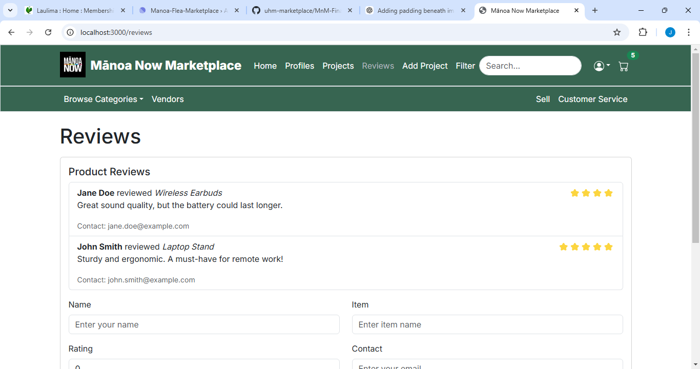

## Overview
**Mānoa Now Marketplace** is a final project that was created through a collaborative effort made by our ICS 314 in-class team. Our vision and goal was to create a marketplace catered to the University of Hawaii at Mānoa community to browse, buy, and sell various items, similarly to websites like Amazon and eBay. This project has allowed us to experience a teamwork setting in a something that could be used outside of class and benefit others in a real-world context.

## My Contributions
I worked along side one of my other teammates to handle the front-end issues. We aimed to make a clean design that implemented user interfaces, ensuring a visually appealing and responsive design using things we learned to make use of in class like React and Bootstrap 5. 
- **Sign-In Authentication:**
  - In order to create the sense of a secure marketplace for the University of Hawaii communtity, I built this sign-in page to require users to sign in with a University of Hawaii *@hawaii.edu* email, making it so that no one outside of the University could buy and sell amongst other UH students.
- **Reviews page:**
  - I developed the reviews page, allowing users to fill out a form and leave feedback and view ratings for items and sellers.
- **View Account Component:**
  - I buiilt the view account component, enabling users to manage their profiles, view activity, and update personal information.

## What I learned
After finishing this project, I was able to enhance my front-end development skills, including responsive design and usability while gaining practical experience with implementing user authentication and managing secure user sessions. I was also able to improve my problem-solving skills while creating dynamic components such as the reviews page and account management features. Overall, I learned how to collaborate effectively within a team, balancing tasks and enduring seamless integration of various features.

## See our final project here!:

[Visit Manoa Marketplace](https://m-n-m-final.vercel.app)
